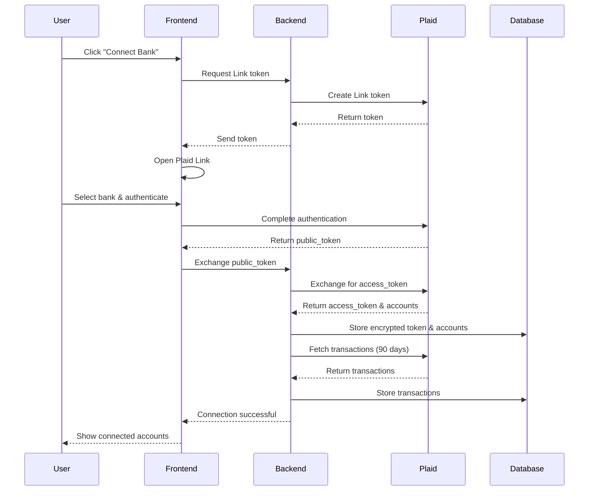

# PRD: Bank Account Connection (Plaid Integration)

## Feature Overview

### Purpose
Enable secure, automated bank account connectivity to import and sync financial transactions in real-time, eliminating manual data entry and ensuring accurate, up-to-date financial records.

### Objectives
1. Connect to 12,000+ financial institutions via Plaid
2. Import 90 days of historical transactions on initial connection
3. Sync new transactions every 4 hours automatically
4. Support multiple account types (checking, savings, credit cards)
5. Achieve 99.5% uptime for transaction syncing

## User Stories & Acceptance Criteria

### Epic: Bank Connection Setup

#### Story 1: Connect Bank Account
**As a** business owner  
**I want to** connect my bank accounts securely  
**So that** transactions import automatically without manual entry

**Acceptance Criteria:**
- Plaid Link modal launches within 2 seconds
- User can search for their financial institution
- Support for username/password and OAuth authentication
- Connection status displayed in real-time
- Multiple accounts from same institution can be selected
- Success confirmation with account details shown
- Error messages are clear and actionable

#### Story 2: Multi-Account Management
**As a** user with multiple business accounts  
**I want to** connect all my financial accounts  
**So that** I have complete financial visibility

**Acceptance Criteria:**
- Connect unlimited accounts (checking, savings, credit cards)
- View all connected accounts in a single dashboard
- See account balances and last sync time
- Ability to nickname accounts for easy identification
- Toggle accounts active/inactive without disconnection
- Group accounts by institution

#### Story 3: Historical Data Import
**As a** new user  
**I want to** import my past transactions  
**So that** I can start with complete financial records

**Acceptance Criteria:**
- Import last 90 days of transactions on initial connection
- Progress indicator during import (X of Y transactions)
- Transactions appear in chronological order
- Duplicate detection if manually entered transactions exist
- Option to extend historical import (up to 2 years for additional fee)
- Import summary showing total transactions imported

### Epic: Transaction Synchronization

#### Story 4: Automatic Transaction Sync
**As a** user  
**I want** new transactions to sync automatically  
**So that** my books are always current

**Acceptance Criteria:**
- Auto-sync every 4 hours during business hours
- Manual sync button with 1-minute cooldown
- Sync status indicator (syncing, last synced, errors)
- New transaction notifications (optional)
- Webhook processing for real-time updates (where supported)
- Sync history log showing last 30 days

#### Story 5: Transaction Data Enhancement
**As a** user  
**I want** transaction details to be complete and accurate  
**So that** categorization and reporting are reliable

**Acceptance Criteria:**
- Merchant name cleaning (remove random characters)
- Transaction date accuracy (posted vs pending)
- Amount validation (debits negative, credits positive)
- Currency handling (USD default, others marked)
- Location data when available
- Transaction type identification (ACH, wire, check, card)

#### Story 6: Connection Maintenance
**As a** user  
**I want** my bank connections to stay active  
**So that** syncing continues without interruption

**Acceptance Criteria:**
- Automatic re-authentication prompts when needed
- Email notifications for connection issues
- In-app alerts for required actions
- Connection health monitoring dashboard
- Clear instructions for fixing broken connections
- 30-day grace period before connection removal

### Epic: Security & Compliance

#### Story 7: Secure Credential Management
**As a** security-conscious user  
**I want** my banking credentials to be secure  
**So that** my financial data is protected

**Acceptance Criteria:**
- Credentials never stored in our database
- Plaid handles all authentication
- Read-only access permissions
- Ability to revoke access anytime
- Audit log of all connection activities
- Two-factor authentication support where available

## Technical Specifications

### System Architecture

```
┌──────────────────────────────────────────────┐
│               Frontend (Next.js)              │
│                                               │
│  ┌─────────────────────────────────────┐     │
│  │        Bank Connection UI           │     │
│  │                                     │     │
│  │  • Account List Component          │     │
│  │  • Plaid Link Integration          │     │
│  │  • Sync Status Dashboard           │     │
│  │  • Transaction Import Progress     │     │
│  └──────────────┬──────────────────────┘     │
│                 ↓                             │
│  ┌─────────────────────────────────────┐     │
│  │       Plaid Link SDK (Web)         │     │
│  └──────────────┬──────────────────────┘     │
└─────────────────┼─────────────────────────────┘
                  ↓
         ┌────────────────┐
         │  Envoy Proxy   │
         └────────┬───────┘
                  ↓
┌──────────────────────────────────────────────┐
│          Backend (Rust/Tonic)                │
│                                               │
│  ┌─────────────────────────────────────┐     │
│  │    Plaid Integration Service        │     │
│  │                                     │     │
│  │  • create_link_token()             │     │
│  │  • exchange_public_token()         │     │
│  │  • sync_transactions()             │     │
│  │  • get_accounts()                  │     │
│  │  • handle_webhook()                │     │
│  │  • refresh_connection()            │     │
│  └──────────────┬──────────────────────┘     │
│                 ↓                             │
│  ┌─────────────────────────────────────┐     │
│  │      Transaction Processor          │     │
│  │                                     │     │
│  │  • Deduplication logic             │     │
│  │  • Data normalization              │     │
│  │  • Merchant cleaning               │     │
│  │  • Balance reconciliation          │     │
│  └──────────────┬──────────────────────┘     │
└─────────────────┼─────────────────────────────┘
                  ↓
         ┌────────────────┐
         │  Plaid API     │
         │                │
         │ • Auth         │
         │ • Transactions │
         │ • Accounts     │
         │ • Webhooks     │
         └────────┬───────┘
                  ↓
         ┌────────────────┐
         │  PostgreSQL    │
         │                │
         │ • accounts     │
         │ • transactions │
         │ • plaid_items  │
         │ • sync_logs    │
         └────────────────┘
```

### API Requirements

#### Plaid Service Endpoints (gRPC)

```protobuf
// plaid.proto
syntax = "proto3";

package plaid;

service PlaidService {
  // Connection Management
  rpc CreateLinkToken(CreateLinkTokenRequest) returns (LinkTokenResponse);
  rpc ExchangePublicToken(ExchangeTokenRequest) returns (ExchangeTokenResponse);
  rpc GetConnectedAccounts(GetAccountsRequest) returns (AccountsResponse);
  rpc DisconnectAccount(DisconnectRequest) returns (StatusResponse);
  rpc RefreshConnection(RefreshRequest) returns (StatusResponse);
  
  // Transaction Operations
  rpc SyncTransactions(SyncRequest) returns (SyncResponse);
  rpc GetTransactions(GetTransactionsRequest) returns (TransactionsResponse);
  rpc ForceSync(ForceSyncRequest) returns (SyncResponse);
  
  // Webhook Handling
  rpc HandleWebhook(WebhookRequest) returns (WebhookResponse);
  rpc GetSyncStatus(SyncStatusRequest) returns (SyncStatusResponse);
}

message CreateLinkTokenRequest {
  string user_id = 1;
  string organization_id = 2;
  repeated string products = 3; // ["transactions", "accounts"]
  repeated string country_codes = 4; // ["US"]
  string language = 5; // "en"
}

message LinkTokenResponse {
  string link_token = 1;
  string expiration = 2;
  string request_id = 3;
}

message ExchangeTokenRequest {
  string public_token = 1;
  string user_id = 2;
  string organization_id = 3;
  map<string, string> metadata = 4;
}

message ExchangeTokenResponse {
  string item_id = 1;
  repeated Account accounts = 2;
  string institution_id = 3;
  string institution_name = 4;
}

message Account {
  string account_id = 1;
  string plaid_account_id = 2;
  string name = 3;
  string official_name = 4;
  string type = 5; // "checking", "savings", "credit"
  string subtype = 6;
  Balance balances = 7;
  string mask = 8; // Last 4 digits
  bool is_active = 9;
  string nickname = 10;
}

message Balance {
  double available = 1;
  double current = 2;
  double limit = 3;
  string iso_currency_code = 4;
  string unofficial_currency_code = 5;
}

message Transaction {
  string transaction_id = 1;
  string account_id = 2;
  double amount = 3;
  string date = 4;
  string datetime = 5;
  string merchant_name = 6;
  string name = 7;
  repeated string category = 8;
  string payment_channel = 9;
  bool pending = 10;
  string pending_transaction_id = 11;
  Location location = 12;
  string iso_currency_code = 13;
}

message Location {
  string address = 1;
  string city = 2;
  string region = 3;
  string postal_code = 4;
  string country = 5;
  double lat = 6;
  double lon = 7;
  string store_number = 8;
}
```

### Database Schema

```sql
-- Plaid connection items
CREATE TABLE plaid_items (
    id UUID PRIMARY KEY DEFAULT gen_random_uuid(),
    organization_id UUID REFERENCES organizations(id) ON DELETE CASCADE,
    item_id VARCHAR(255) UNIQUE NOT NULL, -- Plaid's item_id
    access_token_encrypted TEXT NOT NULL, -- Encrypted
    institution_id VARCHAR(255),
    institution_name VARCHAR(255),
    webhook_url VARCHAR(500),
    status VARCHAR(50) DEFAULT 'ACTIVE', -- ACTIVE, NEEDS_REAUTH, ERROR, DISCONNECTED
    error_code VARCHAR(100),
    error_message TEXT,
    products JSONB, -- ["transactions", "accounts"]
    last_successful_sync TIMESTAMPTZ,
    created_at TIMESTAMPTZ DEFAULT NOW(),
    updated_at TIMESTAMPTZ DEFAULT NOW()
);

-- Financial accounts
CREATE TABLE accounts (
    id UUID PRIMARY KEY DEFAULT gen_random_uuid(),
    organization_id UUID REFERENCES organizations(id) ON DELETE CASCADE,
    plaid_item_id UUID REFERENCES plaid_items(id) ON DELETE CASCADE,
    plaid_account_id VARCHAR(255) UNIQUE NOT NULL,
    account_name VARCHAR(255) NOT NULL,
    official_name VARCHAR(255),
    nickname VARCHAR(255),
    account_type VARCHAR(50) NOT NULL, -- checking, savings, credit, loan
    account_subtype VARCHAR(50),
    mask VARCHAR(10), -- Last 4 digits
    current_balance DECIMAL(15,2),
    available_balance DECIMAL(15,2),
    credit_limit DECIMAL(15,2),
    iso_currency_code CHAR(3) DEFAULT 'USD',
    is_active BOOLEAN DEFAULT TRUE,
    last_sync TIMESTAMPTZ,
    created_at TIMESTAMPTZ DEFAULT NOW(),
    updated_at TIMESTAMPTZ DEFAULT NOW()
);

-- Transactions
CREATE TABLE transactions (
    id UUID PRIMARY KEY DEFAULT gen_random_uuid(),
    organization_id UUID REFERENCES organizations(id) ON DELETE CASCADE,
    account_id UUID REFERENCES accounts(id) ON DELETE CASCADE,
    plaid_transaction_id VARCHAR(255) UNIQUE NOT NULL,
    amount DECIMAL(15,2) NOT NULL,
    transaction_date DATE NOT NULL,
    transaction_datetime TIMESTAMPTZ,
    merchant_name VARCHAR(255),
    transaction_name VARCHAR(500),
    plaid_categories JSONB, -- Original Plaid categories
    category_id UUID, -- Our category assignment
    payment_channel VARCHAR(50), -- online, in_store, other
    is_pending BOOLEAN DEFAULT FALSE,
    pending_transaction_id VARCHAR(255),
    location JSONB,
    iso_currency_code CHAR(3) DEFAULT 'USD',
    notes TEXT,
    is_transfer BOOLEAN DEFAULT FALSE,
    transfer_account_id UUID REFERENCES accounts(id),
    created_at TIMESTAMPTZ DEFAULT NOW(),
    updated_at TIMESTAMPTZ DEFAULT NOW()
);

-- Sync logs
CREATE TABLE sync_logs (
    id UUID PRIMARY KEY DEFAULT gen_random_uuid(),
    plaid_item_id UUID REFERENCES plaid_items(id) ON DELETE CASCADE,
    sync_type VARCHAR(50), -- INITIAL, SCHEDULED, MANUAL, WEBHOOK
    status VARCHAR(50), -- STARTED, SUCCESS, FAILED
    transactions_added INT DEFAULT 0,
    transactions_modified INT DEFAULT 0,
    transactions_removed INT DEFAULT 0,
    accounts_updated INT DEFAULT 0,
    error_code VARCHAR(100),
    error_message TEXT,
    started_at TIMESTAMPTZ DEFAULT NOW(),
    completed_at TIMESTAMPTZ,
    duration_ms INT
);

-- Webhook events
CREATE TABLE webhook_events (
    id UUID PRIMARY KEY DEFAULT gen_random_uuid(),
    plaid_item_id UUID REFERENCES plaid_items(id) ON DELETE CASCADE,
    webhook_type VARCHAR(100), -- TRANSACTIONS, ITEM, ERROR
    webhook_code VARCHAR(100),
    payload JSONB,
    processed BOOLEAN DEFAULT FALSE,
    processed_at TIMESTAMPTZ,
    error_message TEXT,
    received_at TIMESTAMPTZ DEFAULT NOW()
);

-- Indexes
CREATE INDEX idx_accounts_org ON accounts(organization_id);
CREATE INDEX idx_accounts_plaid ON accounts(plaid_account_id);
CREATE INDEX idx_transactions_org ON transactions(organization_id);
CREATE INDEX idx_transactions_account ON transactions(account_id);
CREATE INDEX idx_transactions_date ON transactions(transaction_date);
CREATE INDEX idx_transactions_plaid ON transactions(plaid_transaction_id);
CREATE INDEX idx_sync_logs_item ON sync_logs(plaid_item_id);
CREATE INDEX idx_webhook_events_item ON webhook_events(plaid_item_id);
CREATE INDEX idx_webhook_events_processed ON webhook_events(processed);
```

### Integration Flow



## UI/UX Requirements

### Bank Connection Flow

```
┌─────────────────────────────────────┐
│       Connected Accounts             │
│                                      │
│  Your Financial Accounts            │
│                                      │
│  ┌──────────────────────────────┐   │
│  │ 🏦 Chase Bank               │   │
│  │                              │   │
│  │ Business Checking ****1234  │   │
│  │ Balance: $12,456.78         │   │
│  │ Last sync: 2 hours ago      │   │
│  │                              │   │
│  │ Business Savings ****5678   │   │
│  │ Balance: $45,000.00         │   │
│  │ Last sync: 2 hours ago      │   │
│  └──────────────────────────────┘   │
│                                      │
│  ┌──────────────────────────────┐   │
│  │ 💳 Capital One              │   │
│  │                              │   │
│  │ Business Credit ****9012    │   │
│  │ Balance: -$3,234.56         │   │
│  │ Last sync: 2 hours ago      │   │
│  └──────────────────────────────┘   │
│                                      │
│  ┌──────────────────────────────┐   │
│  │   + Connect Another Bank     │   │
│  └──────────────────────────────┘   │
│                                      │
│  Total Balance: $54,222.22          │
└─────────────────────────────────────┘
```

### Plaid Link Integration

```
┌─────────────────────────────────────┐
│        Select Your Bank              │
│                                      │
│  🔍 Search for your bank            │
│  ┌──────────────────────────────┐   │
│  │                              │   │
│  └──────────────────────────────┘   │
│                                      │
│  Popular Banks                      │
│  ┌──────────────────────────────┐   │
│  │ 🏦 Bank of America          │   │
│  │ 🏦 Chase                    │   │
│  │ 🏦 Wells Fargo              │   │
│  │ 🏦 Citi                     │   │
│  │ 🏦 US Bank                  │   │
│  │ 💳 American Express         │   │
│  └──────────────────────────────┘   │
│                                      │
│  [Cancel]                           │
└─────────────────────────────────────┘
           ↓ (After selection)
┌─────────────────────────────────────┐
│      Sign in to Chase                │
│                                      │
│  Username                           │
│  ┌──────────────────────────────┐   │
│  │                              │   │
│  └──────────────────────────────┘   │
│                                      │
│  Password                           │
│  ┌──────────────────────────────┐   │
│  │ ••••••••                    │   │
│  └──────────────────────────────┘   │
│                                      │
│  [Continue]                         │
│                                      │
│  🔒 Your credentials are never      │
│     stored by our application       │
└─────────────────────────────────────┘
```

### Transaction Import Progress

```
┌─────────────────────────────────────┐
│     Importing Your Transactions      │
│                                      │
│  ┌──────────────────────────────┐   │
│  │ ████████████████████░░░░░░░░ │   │
│  └──────────────────────────────┘   │
│           75% Complete               │
│                                      │
│  Importing from Chase Bank...       │
│  1,234 of 1,645 transactions        │
│                                      │
│  ✓ Connected to bank                │
│  ✓ Retrieved account details        │
│  ⟳ Importing transactions           │
│  ○ Categorizing transactions        │
│                                      │
│  This may take a few minutes...     │
└─────────────────────────────────────┘
```

### Connection Management

```
┌─────────────────────────────────────┐
│      Account Settings                │
│                                      │
│  Chase Business Checking ****1234   │
│                                      │
│  Nickname                           │
│  ┌──────────────────────────────┐   │
│  │ Main Operating Account       │   │
│  └──────────────────────────────┘   │
│                                      │
│  Status: ✅ Connected               │
│  Last Sync: Oct 29, 2024 2:45 PM   │
│  Next Sync: Oct 29, 2024 6:45 PM   │
│                                      │
│  ┌──────────────────────────────┐   │
│  │     🔄 Sync Now               │   │
│  └──────────────────────────────┘   │
│                                      │
│  Advanced Options                   │
│  ┌──────────────────────────────┐   │
│  │ ⚙️ Re-authenticate           │   │
│  │ 📊 View Sync History         │   │
│  │ 🔕 Pause Syncing             │   │
│  │ 🗑️ Disconnect Account        │   │
│  └──────────────────────────────┘   │
└─────────────────────────────────────┘
```

## Security Requirements

### Data Security
1. **Encryption**
   - Access tokens encrypted with AES-256-GCM
   - TLS 1.3 for all API communications
   - Encrypted storage of sensitive account data
   - No storage of user banking credentials

2. **Access Control**
   - Read-only access to bank accounts
   - User consent required for each connection
   - Granular permission scopes
   - Regular access token rotation

3. **Compliance**
   - PCI DSS compliance for payment data
   - Bank-grade security standards
   - SOC 2 Type II compliance roadmap
   - GDPR/CCPA data handling

### Monitoring & Alerts
1. **Connection Health**
   - Real-time monitoring of connection status
   - Alert on authentication failures
   - Track sync success rates
   - Monitor API rate limits

2. **Security Events**
   - Log all access token usage
   - Track connection attempts
   - Monitor for unusual activity patterns
   - Alert on multiple failed connections

## Success Metrics

### Key Performance Indicators

| Metric | Target | Measurement |
|--------|--------|-------------|
| Connection Success Rate | >95% | Successful connections/attempts |
| Sync Reliability | >99.5% | Successful syncs/total syncs |
| Transaction Import Speed | <30 sec | Time for 1000 transactions |
| Connection Retention | >90% | Active connections after 30 days |
| Re-auth Response Time | <4 hours | Time to fix broken connections |
| Data Freshness | <4 hours | Max age of transaction data |
| Duplicate Rate | <0.1% | Duplicate transactions/total |
| Support Tickets | <2% | Connection issues/active users |

### User Experience Metrics
- Time to first connection: <2 minutes
- Accounts per user: Average 2.5
- Manual sync usage: <10% of syncs
- Connection health score: >4.5/5

## Dependencies & Risks

### External Dependencies

| Dependency | Purpose | Risk Level | Mitigation |
|------------|---------|------------|------------|
| Plaid API | Bank connectivity | Critical | SLA monitoring, fallback providers |
| Plaid webhook service | Real-time updates | High | Polling fallback, retry logic |
| Bank APIs | Data source | High | Plaid handles redundancy |
| PostgreSQL | Data storage | High | Replication, regular backups |

### Technical Risks

| Risk | Impact | Probability | Mitigation |
|------|--------|-------------|------------|
| Plaid service outage | Critical | Low | Status page monitoring, user notifications |
| Bank API changes | High | Medium | Plaid handles updates, version monitoring |
| Rate limit exceeded | Medium | Medium | Request queuing, backoff strategy |
| Token expiration | Medium | High | Proactive refresh, user notifications |
| Data sync failures | High | Medium | Retry logic, manual sync option |

## Testing Requirements

### Unit Testing
```rust
// Example unit tests
#[cfg(test)]
mod tests {
    use super::*;

    #[tokio::test]
    async fn test_create_link_token() {
        // Test link token creation
    }

    #[test]
    fn test_transaction_deduplication() {
        // Test duplicate detection logic
    }

    #[test]
    fn test_merchant_name_cleaning() {
        // Test merchant name normalization
    }
}
```

### Integration Testing
- Plaid sandbox environment testing
- Mock webhook handling
- Transaction import flow
- Error handling scenarios
- Rate limit behavior

### E2E Testing Scenarios
1. Complete bank connection flow
2. Historical data import
3. Webhook transaction updates
4. Connection re-authentication
5. Multiple account management
6. Sync failure recovery

### Performance Testing
- Import 10,000 transactions in <60 seconds
- Handle 100 concurrent connections
- Process 1000 webhooks/minute
- Database query optimization

## Implementation Timeline

### Week 1: Foundation
- Day 1-2: Database schema setup
- Day 2-3: Plaid SDK integration
- Day 4-5: Basic API endpoints

### Week 2: Core Features
- Day 1-2: Link token flow
- Day 2-3: Transaction import
- Day 4-5: Webhook handling

### Week 3: Polish & Testing
- Day 1-2: Error handling
- Day 2-3: UI refinements
- Day 4-5: Testing & monitoring

### Milestones
- [ ] Plaid account approved
- [ ] Database schema deployed
- [ ] Link flow functional
- [ ] Transaction import working
- [ ] Webhook processing active
- [ ] Monitoring dashboard live
- [ ] 10 beta users connected

## Cost Analysis

### Monthly Costs (1000 users)
- Plaid API: $500 (Development), $2000 (Production)
- Database storage: ~$200 (50GB estimated)
- Webhook processing: ~$50 (compute)
- Total: ~$2,750/month

### Cost per User
- Average: $2.75/user/month
- Break-even at pricing: Covered at $29/month tier

## Post-MVP Enhancements

### Phase 2 Features
1. Investment account support
2. International bank support
3. Manual transaction entry fallback
4. CSV import for unsupported banks
5. Transaction search and filtering

### Phase 3 Features
1. Bank statement reconciliation
2. Cash flow forecasting
3. Multiple currency support
4. Advanced duplicate detection
5. Transaction tagging system